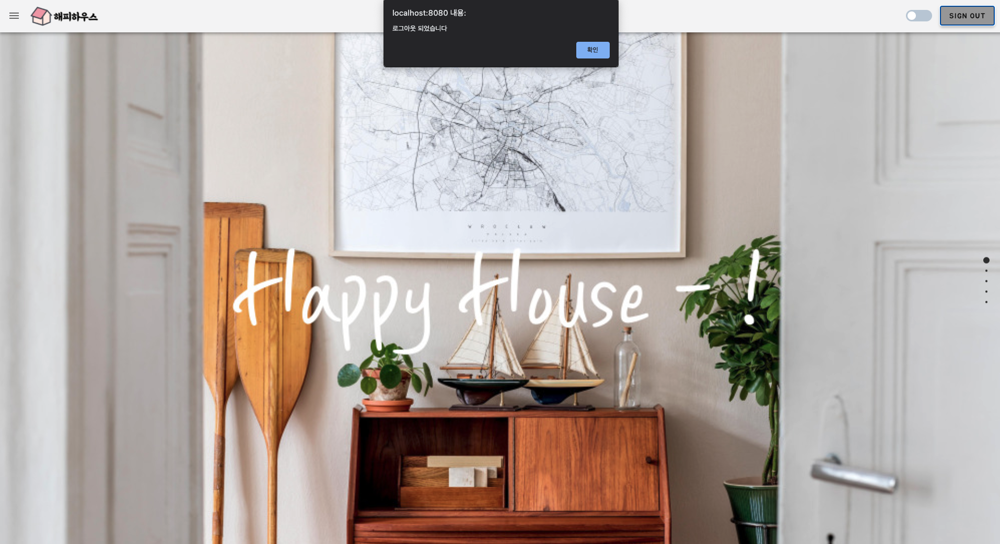
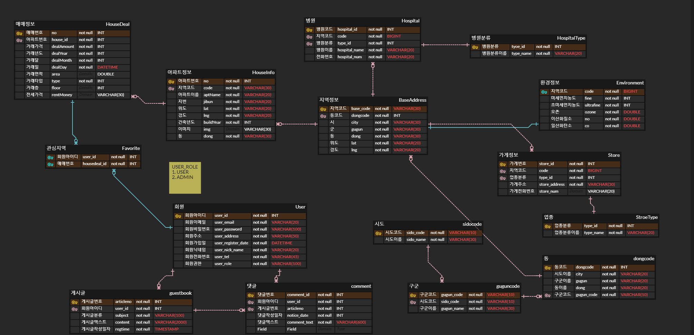

# happyhouse-back BE : Spring Boot + MyBatis + Jwt + JPA

## :house: 2021 HappyHouse_Web_Project :house:

- **부동산거래(주택/아파트 매매와 월세) 웹서비스**  
   _- 부동산 거래 외 주변 상권 정보, 관심 매물 선택, 날씨정보, 환경정보 등 다양한 기능 제공 -_

## :mag: 개발환경

```java
1. 개발IDE - Spring Tool Suite 3 <br/>
2. Tomcat Server - Apache Tomcat 9.0 <br/>
3. MySQL - MySQL 8.0 <br/>
4. Mybatis - Mybatis 3 <br/>
5. Spring Boot - 2.1.4 RELEASE <br/>
6. JWT + JPA + Spring Security <br/>
7. Swagger - 2.9.2 <br/>

```

## :loudspeaker: 기본 UI

- 메인화면 및 로그인
<p align="center">
  
  
  
</p>

- 매물 검색 기능
<p align="center">
  
  
  
</p>

- 회원 관리 및 관심 매물
<p align="center">
  
  
  
  
</p>

- 실시간 뉴스 기능
<p align="center">
  
</p>

## :open_file_folder: ER DIAGRAM (보완중)

<p align="center">
  
</p>
https://www.erdcloud.com/d/jic64GBJMyhuSFmNe

## 👮 : API 문서 (개발중)

https://www.notion.so/HappyHouse-API-83bbf191abae40e78ba431e37980f842

## 👮 : 관련 자료 정리

https://drive.google.com/drive/folders/1SFRI2Cp1SWX1Z8sR6PGsYdYlOXa6z6R4

## :1234: 구현단계

1. 기본 JAVA 코드 구현
2. FRONTEND 설계
3. DB 설계
4. MVC PATTERN으로 구현
5. DB 연동 및 MVC 확대
6. Spring Boot 변경, FE Vue.js + Vuetify 적용, JPA + JWT + Spring Security 적용

## :round_pushpin: 프로젝트 구조

<p align="center">
  
</p>

- **Model-View-Controller구조 FLOW**

1. _Model – JavaBean DI 및 어노테이션 활용(Business layer)_
2. _View – JSP, HTML, Ajax 등을 이용(Presentation layer)_
3. _Controller – Client로부터 HTTP Request수신_

## :girl::boy: Author

[Sujin](https://github.com/SujinJeong)

- Blog : https://blog.naver.com/lovesujin051
- E-mail : lovesujin05173@gmail.com

[Donggil](https://github.com/donggillee-dev)

- E-mail : donggillee94@gmail.com
